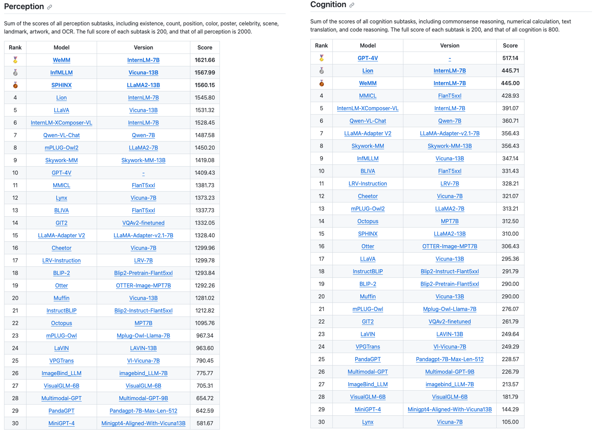

# WeMM

Multi-modal LLM with representation routing. Currently, we have released the model that achieves 2066.66 points on the MME benchmark. More powerful chat model will come later.


## News
+ 2023-11-20: Inference and mme evaluation code released. Model released.
+ 2023-11-13: WeMM scored 2066.66 points on [MME](https://github.com/BradyFU/Awesome-Multimodal-Large-Language-Models/tree/Evaluation) full benchmark, which was top1 at the time. 
  - [x] Perception score = 1621.66. Ranked the first place.
  - [x] Cognition score = 445. Ranked the third place.
+ 2023-10-13: WeMM achieved a perception score of 1551.63 on [MME](https://github.com/BradyFU/Awesome-Multimodal-Large-Language-Models/tree/Evaluation) benchmark, which was the state-of-the-art performance at the time. 
+ 2023-9-13: WeMM scored 68.6 points on [MMBench](https://opencompass.org.cn/leaderboard-multimodal), ranking second place at the time.

## Inference
The following command will start an interactive interface that allow users to input image path and prompt and get response from WeMM.
```
python3 inference.py
```

## MME evaluation
First copy the official MME evaluation files into ./MME_Benchmark_release_version. Then run:
```
bash mme_eval.sh
```

## MME Benchmark
WeMM achieved 2066.66 points (1621.66 perception score + 445 cognition score), which was top1 on [MME](https://github.com/BradyFU/Awesome-Multimodal-Large-Language-Models/tree/Evaluation) full benchmark on 2023-11-13


## MMBench
WeMM ranks second place on [MMBench](https://opencompass.org.cn/leaderboard-multimodal) on 2023-9-13.


