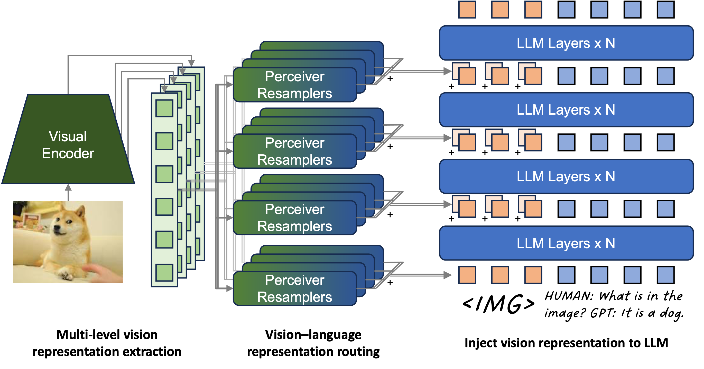
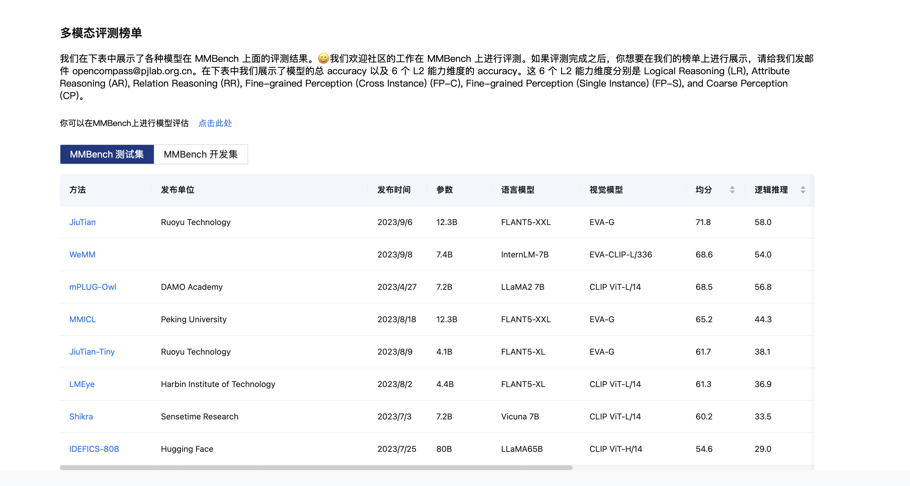
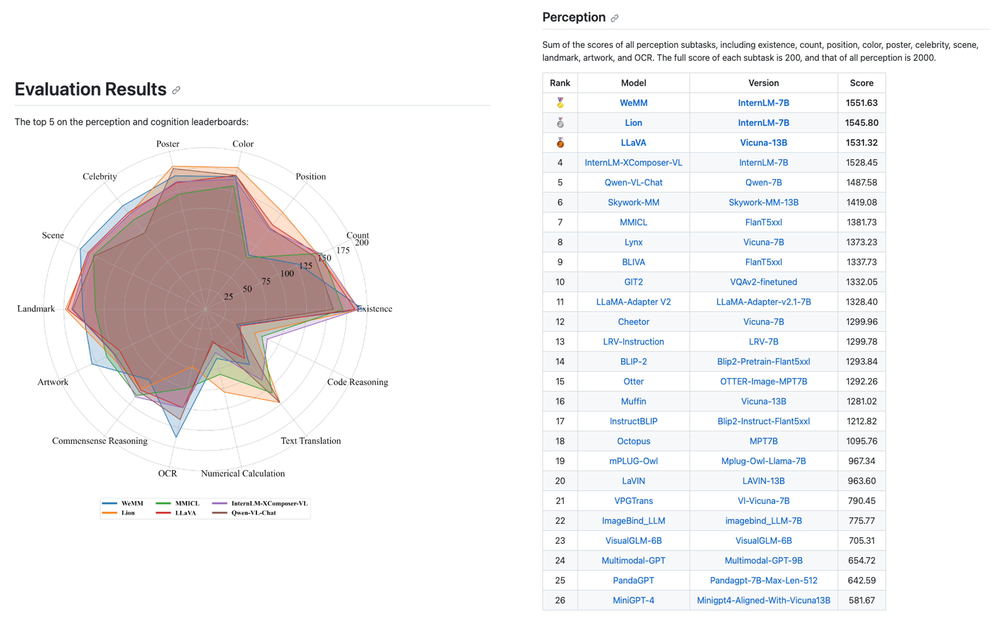

# WeMM

Multi-modal LLM with representation routing. Codes and details will be released soon.

## News

+ 2023-11-13: WeMM scored 2066.66 points, which was top1 on [MME](https://github.com/BradyFU/Awesome-Multimodal-Large-Language-Models/tree/Evaluation) full benchmark at the time. 
  - [x] Perception score = 1621.66. Definitely better than GPT-4V. (If we assume GPT-4V got full score on the celebrity task, then GPT-4V would get 1409.43 + 200 = 1609.43 points) 
  - [x] Cognition score = 435. Ranks the third place at the time.
+ 2023-10-13: WeMM achieved a perception score of 1551.63 on [MME](https://github.com/BradyFU/Awesome-Multimodal-Large-Language-Models/tree/Evaluation) benchmark, which was the state-of-the-art performance at the time. 
+ 2023-9-13: WeMM scored 68.6 points on [MMBench](https://opencompass.org.cn/leaderboard-multimodal), ranking second place at the time.

## MMBench
WeMM ranks second place on [MMBench](https://opencompass.org.cn/leaderboard-multimodal) on 2023-9-13.

## MME Benchmark
WeMM achieved state-of-the-art performance on [MME](https://github.com/BradyFU/Awesome-Multimodal-Large-Language-Models/tree/Evaluation) perception benchmark on 2023-10-13

