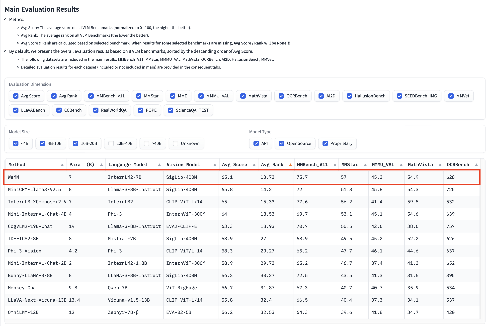

# WeMM

[\[📖中文版本\]](./README_cn.md)  [\[🤗 HuggingFace\]](https://huggingface.co/feipengma/WeMM)

WeMM is the most recent version of the multimodal large language model introduced by WeChatCV. Capable of engaging in Chinese-English bilingual conversations alongside dynamic high-resolution images, WeMM stands as the most powerful model with 10 billion parameters in the multimodal large language model rankings. Its overall evaluation score (Avg Rank) places it within the top tier. (Refer to [vlm_leaderboard](https://huggingface.co/spaces/opencompass/open_vlm_leaderboard))


## News 🚀🚀🚀
- `2024/06/27`: 🚀🚀🚀🔥🔥🔥 The WeMM-Chat-2K-CN model is now available, supporting 2K resolution image input.
- `2024/06/21`: 🚀🚀🚀 The WeMM-Chat-CN model has been launched, improving the model's bilingual dialogue capabilities in both Chinese and English.
- `2024/06/09`: 🚀🚀🔥 WeMM-1.2(VL) model weight and test code are released, ranking first among 10-billion-parameter models in all MLLM benchmark tests.
- `2023/11/20`: Model weight, inference code, and MME evaluation code have been released.
- `2023/11/13`: 🚀 WeMM-1.0 scored 2066.66 points in the full set of [MME](https://github.com/BradyFU/Awesome-Multimodal-Large-Language-Models/tree/Evaluation) benchmark tests, ranking first at the time. Its perception score was 1621.66, ranking first, and its cognition score was 445, ranking third.
- `2023/10/13`: WeMM-1.0 achieved a perception score of 1551.63 on the [MME](https://github.com/BradyFU/Awesome-Multimodal-Large-Language-Models/tree/Evaluation) benchmark, representing the state-of-the-art performance at that time.
- `2023/09/13`: WeMM scored 68.6 points on the [MMBench](https://opencompass.org.cn/leaderboard-multimodal) leaderboard, ranking second place at the time.

## Model Zoo

**Vision Large Language Model**
| Model         | Date       | Download       |  Note           |
| --------------| ---------- | -------------- | --------------- |
| WeMM-Chat-2K-CN　|2024.06.27 | 🤗 [HF link](https://huggingface.co/feipengma/WeMM-Chat-2k-CN) | 🚀🚀 Supports image input at a resolution of 2K.  |
| WeMM-Chat-CN　|2024.06.21 | 🤗 [HF link](https://huggingface.co/feipengma/WeMM-Chat-CN) | 🚀🚀 Enhanced bilingual dialogue capabilities in Chinese and English.  |
| WeMM-1.2（VL） | 2024.06.09 | 🤗 [HF link](https://huggingface.co/feipengma/WeMM)            | 🚀🚀 Ranked first among models with ten billion parameters in all benchmark tests of multimodal large language models.  |

## Multimodal 

WeMM is a multimodal language model with bilingual dialogue capabilities in Chinese and English. The evaluation results for its related classic tasks are as follows.

|**Method**| **Param(B)** | **Avg Score** | **Avg Rank** | **MMBench_V11** | **MMStar** | **MMMU_VAL** | **MathVista** | **OCRBench** | **AI2D** | **HallusionBench** | **MMVet** | **MME** | **SEEDBench_IMG** | **POPE** | **RealWorldQA** | **ScienceQA_TEST** | **CCBench** | **LLaVABench** |
|-------------------------|:----------------:|:------------:|:----------:|:---------:|:----------:|:---------:|:---------:|:----------:|:--------------:|:-----------:|:----------:|:-------------:|:----------:|:-------------:|:------------:|:-------------:|:------------:|:------------:|
| **GPT-4o,20240513,high** |    |    |    | 82.8 | 61.6 | 62.8 | 56.5 | 663 | 82.2 | 51.7 | 66.5 | 2328.7 | 76.4 |    | 68.6 |    | 70.6 | 97.2 |
| **GPT-4v, 20240409,high** |    |    |    | 79.8 | 56 | 61.7 | 54.7 | 656 | 78.6 | 43.9 | 67.5 | 2070.2 | 73 |    | 68 |    | 57.3 | 99.8 |
| **WeMM**                |  7  | 65.1 | 13.73 | 75.7 |  57  | 45.3 | 54.9 | 628 | 77.9 | 47.5 | 45   | 2150.1 | 75.9 | 86.7 | 68.1 | 83.3 | 48   | 70.9 |
| **MiniCPM_Llama3-v2.5** |  8  | 65.8 | 14.2  | 72   | 51.8 | 45.8 | 54.3 | 725 | 78.4 | 42.4 | 52.8 | 2024.6 | 72.3 | 86.7 | 63.5 | 89.2 | 45.9 | 86.7 | 
| **InternLM-XComposer2-VL**| 7 | 65   | 15.33 | 77.6 | 56.2 | 41.4 | 59.5 | 532 | 81.2 | 41   | 46.7 | 2220.4 | 74.9 | 83   | 63.8 | 96.7 | 48.2 | 72.6 |
| **Qwen-VL-Max**         |     | 65.3 | 16.73 | 74.6 | 49.5 | 52   | 43.4 | 684 | 75.7 | 41.2 | 61.8 | 2281.7 | 72.7 | 71.9 | 61.3 | 80   | 63.5 | 82.3 |
| **Mini-InternVL-Chat-4B-V1.5** | 4 |64 |18.53| 69.7 | 53.1 | 45.1 | 54.6 | 639 | 77   |  43  | 43.6 | 2079.2 | 72.2 | 81.4 | 60.8 | 92.6 | 59.4 | 68.6 |
| **IDEFICS2-8B**         |  8  | 58.9 |   27  | 68.9 | 49.5 | 45.2 | 52.2 | 626 | 72.3 | 39.1 | 34   | 1847.6 | 71.9 | 86.2 | 60.7 | 88.7 | 37.6 | 49.1 |
| **Qwen-VL-Plus**        |     | 59.7 | 28.87 | 66.2 | 39.7 | 39.8 | 37.6 | 726 | 65.7 | 40.6 | 55.7 | 2229.8 | 65.7 | 85.4 | 44.6 | 73.4 | 55.1 | 73.7 | 
| **Phi-3-Vision**        | 4.2 | 58.3 | 29.27 | 65.2 | 47.7 | 46.1 | 44.6 | 637 | 78.4 | 39   | 44.1 | 1508   | 70.9 | 83.7 | 58.8 | 90   | 24.1 | 63.9 | 
| **Mini-InternVL-Chat-2B-V1.5**|2|58.9| 29.73 | 65.2 | 46.7 | 37.4 | 41.3 | 652 | 69.7 | 37.3 | 35.5 | 1906.1 | 69.5 | 85.4 | 57.9 | 84.8 | 62.9 | 57.3 | 

In all benchmark evaluations, WeMM uses the comprehensive average ranking (Avg Rank) as the primary performance reference indicator due to the significant differences in score distribution among different benchmarks. WeMM ranks first among 10-billion-parameter models and is also in the top tier among all MLLM models.

| Parameters < 20B | All VLLM |
|:--:|:---:|
|     |     |

## Requirements
+ transformers==4.40.0
+ python >= 3.8
+ torch >= 2.0.0
+ flash-attention2

For detailed requirements, please refer to [requirements.txt](requirements.txt).

## Inference
Feel free to visit our [github](https://github.com/scenarios/WeMM/) for more execution code.

The following code will initiate an interactive interface that allows users to input an image path and prompt to receive a response from WeMM.

+ WeMM-1.2（VL）
```python
import torch
from PIL import Image
from transformers import AutoModel, GenerationConfig

model_path = 'feipengma/WeMM' # the path to the model 
wemm = AutoModel.from_pretrained(model_path, torch_dtype=torch.bfloat16, trust_remote_code=True)
wemm.cuda()
wemm.eval()

query = 'Describe this image.'
image = 'path/to/your/image'
pred = wemm.mm_generate(image, query)
```

+ WeMM-Chat-CN
```python
import torch
from PIL import Image
from transformers import AutoModel, GenerationConfig

model_path = 'feipengma/WeMM-Chat-CN'
wemm = AutoModel.from_pretrained(model_path, torch_dtype=torch.bfloat16, trust_remote_code=True)
wemm.cuda()
wemm.eval()

query = 'Why is the ocean blue?'
pred = wemm.mm_generate(image, query)
```
+ WeMM-Chat-2K-CN
```python
import torch
from PIL import Image
from transformers import AutoModel, GenerationConfig

model_path = 'feipengma/WeMM-Chat-2k-CN'
wemm = AutoModel.from_pretrained(model_path, torch_dtype=torch.bfloat16, trust_remote_code=True)
wemm.cuda()
wemm.eval()

query = 'Why is the ocean blue?'
pred = wemm.mm_generate(image, query)
```

## Example
**查看中文示例在[\[📖中文版本\]](./README_cn.md)**
+ Example 1

|Image| Conversation Example |
|:--:|:---:|
|     |     |

+ Example 2

|Image| Conversation Example |
|:--:|:---:|
|     |     |


+ Example 3
  
|Image | Conversation Example |
|:--:|:---:|
|     |     |

## Acknowledgement
In our WeMM research, we referred to the base vision backbone code incorporating the navit980 structure from [Idefics2](https://huggingface.co/HuggingFaceM4/idefics2-8b), as well as the LLM framework from [Internlm2](https://huggingface.co/internlm/internlm2-chat-7b). We greatly appreciate the outstanding work of Idefics2 and InternLM2.

## License

This project is released under the [MIT license](LICENSE). Parts of this project contain code and models from other sources, which are subject to their respective licenses.

## Main Participating Institutions
+ Tencent WeChatCV Team
+ Zhejiang University
