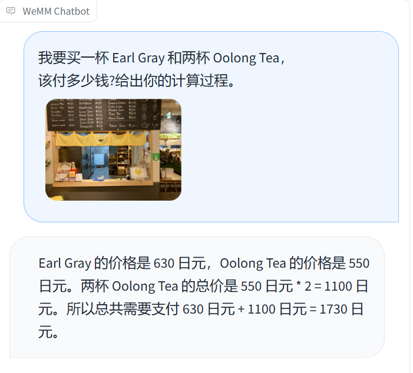
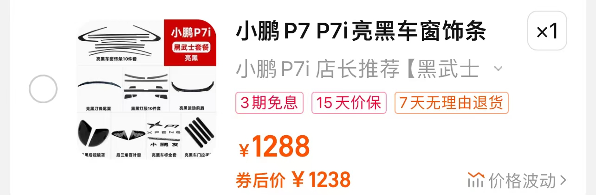
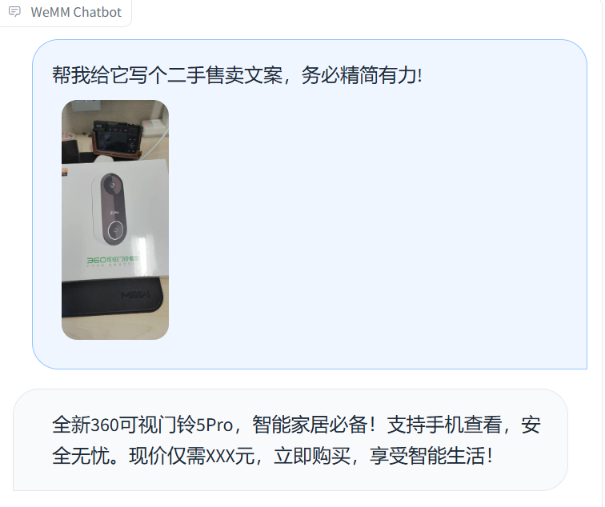

# WeMM

[\[📖English Version\]](./README.md)  [\[🤗 HuggingFace\]](https://huggingface.co/feipengma/WeMM)

Wemm 是 WeChatCV 推出的最新一代多模态大语言模型。**WeMM** 具备动态高分辨率图片下的中英双语对话能力，在多模态大语言模型的榜单中是百亿参数级别最强模型，整体测评结果（Avg Rank）位居第一梯队 ([vlm_leaderboard](https://huggingface.co/spaces/opencompass/open_vlm_leaderboard))。


## 最新消息 🚀🚀🚀
- `2024/06/27`: 🚀🚀🚀🔥🔥🔥发布 WeMM-Chat-2K-CN 模型，支持2K分辨率的图像输入。
- `2024/06/21`: 🚀🚀🚀发布 WeMM-Chat-CN 模型，加强了模型的中英文双语对话能力。
- `2024/06/09`: 🚀🚀🔥发布 WeMM-1.2(VL) 模型及测试代码，在多模态大语言模型全部基准测试中的百亿参数模型里排名第一。
- `2023/11/20`: 已发布推理和mme评估代码。模型已发布。
- `2023/11/13`: 🚀WeMM-1.0 在[MME](https://github.com/BradyFU/Awesome-Multimodal-Large-Language-Models/tree/Evaluation) 全套基准测试中得分2066.66分，当时位居第一。其中感知得分为1621.66，排名第一。认知得分为445，排名第三。
- `2023/10/13`: WeMM-1.0 在[MME](https://github.com/BradyFU/Awesome-Multimodal-Large-Language-Models/tree/Evaluation) 基准测试中获得了1551.63的感知得分，当时这是最优越的表现。
- `2023/09/13`: WeMM-1.0 在 [MMBench](https://opencompass.org.cn/leaderboard-multimodal) 得分68.6分，当时排名第二。

## 模型仓库

**视觉大语言模型**
| 模型                      | 日期       | 下载        |  摘要            |
| -------------------------------- | ---------- | ------------------------------------------------------------------------------------ | ------------------------------------------------------------------------------------------------------------------------------------------------------------------ |
| WeMM-Chat-2K-CN　|2024.06.27 | 🤗 [HF link](https://huggingface.co/feipengma/WeMM-Chat-2k-CN) | 🚀🚀支持2K分辨率的图片输入  |
| WeMM-Chat-CN　|2024.06.21 | 🤗 [HF link](https://huggingface.co/feipengma/WeMM-Chat-CN) | 🚀🚀加强了中英双语对话能力  |
| WeMM-1.2（VL） | 2024.06.09 | 🤗 [HF link](https://huggingface.co/feipengma/WeMM)            | 🚀🚀在多模态大语言模型全部基准测试中的百亿参数模型里排名第一   |

## 多模态能力

WeMM 是一个多模态语言模型，具备中英文双语对话能力，其相关经典任务的评测结果如下：

|**Method**| **Param(B)** | **Avg Score** | **Avg Rank** | **MMBench_V11** | **MMStar** | **MMMU_VAL** | **MathVista** | **OCRBench** | **AI2D** | **HallusionBench** | **MMVet** | **MME** | **SEEDBench_IMG** | **POPE** | **RealWorldQA** | **ScienceQA_TEST** | **CCBench** | **LLaVABench** |
|-------------------------|:----------------:|:------------:|:----------:|:---------:|:----------:|:---------:|:---------:|:----------:|:--------------:|:-----------:|:----------:|:-------------:|:----------:|:-------------:|:------------:|:-------------:|:------------:|:------------:|
| **GPT-4o,20240513,high** |    |    |    | 82.8 | 61.6 | 62.8 | 56.5 | 663 | 82.2 | 51.7 | 66.5 | 2328.7 | 76.4 |    | 68.6 |    | 70.6 | 97.2 |
| **GPT-4v, 20240409,high** |    |    |    | 79.8 | 56 | 61.7 | 54.7 | 656 | 78.6 | 43.9 | 67.5 | 2070.2 | 73 |    | 68 |    | 57.3 | 99.8 |
| **WeMM**                |  7  | 65.1 | 13.73 | 75.7 |  57  | 45.3 | 54.9 | 628 | 77.9 | 47.5 | 45   | 2150.1 | 75.9 | 86.7 | 68.1 | 83.3 | 48   | 70.9 |
| **MiniCPM_Llama3-v2.5** |  8  | 65.8 | 14.2  | 72   | 51.8 | 45.8 | 54.3 | 725 | 78.4 | 42.4 | 52.8 | 2024.6 | 72.3 | 86.7 | 63.5 | 89.2 | 45.9 | 86.7 | 
| **InternLM-XComposer2-VL**| 7 | 65   | 15.33 | 77.6 | 56.2 | 41.4 | 59.5 | 532 | 81.2 | 41   | 46.7 | 2220.4 | 74.9 | 83   | 63.8 | 96.7 | 48.2 | 72.6 |
| **Qwen-VL-Max**         |     | 65.3 | 16.73 | 74.6 | 49.5 | 52   | 43.4 | 684 | 75.7 | 41.2 | 61.8 | 2281.7 | 72.7 | 71.9 | 61.3 | 80   | 63.5 | 82.3 |
| **Mini-InternVL-Chat-4B-V1.5** | 4 |64 |18.53| 69.7 | 53.1 | 45.1 | 54.6 | 639 | 77   |  43  | 43.6 | 2079.2 | 72.2 | 81.4 | 60.8 | 92.6 | 59.4 | 68.6 |
| **IDEFICS2-8B**         |  8  | 58.9 |   27  | 68.9 | 49.5 | 45.2 | 52.2 | 626 | 72.3 | 39.1 | 34   | 1847.6 | 71.9 | 86.2 | 60.7 | 88.7 | 37.6 | 49.1 |
| **Qwen-VL-Plus**        |     | 59.7 | 28.87 | 66.2 | 39.7 | 39.8 | 37.6 | 726 | 65.7 | 40.6 | 55.7 | 2229.8 | 65.7 | 85.4 | 44.6 | 73.4 | 55.1 | 73.7 | 
| **Phi-3-Vision**        | 4.2 | 58.3 | 29.27 | 65.2 | 47.7 | 46.1 | 44.6 | 637 | 78.4 | 39   | 44.1 | 1508   | 70.9 | 83.7 | 58.8 | 90   | 24.1 | 63.9 | 
| **Mini-InternVL-Chat-2B-V1.5**|2|58.9| 29.73 | 65.2 | 46.7 | 37.4 | 41.3 | 652 | 69.7 | 37.3 | 35.5 | 1906.1 | 69.5 | 85.4 | 57.9 | 84.8 | 62.9 | 57.3 | 

WeMM在全部的BenchMark测评中，由于不同BenchMark的分数分布差异较大，我们使用综合平均排名（Avg Rank）作为主性能参考指标。在百亿参数级别的模型中WeMM位列第一，在全部的MLLM中也位于第一梯队。


|模型参数量小于20B| 所有的视觉大语言模型 |
|:--:|:---:|
|     |     |

## 环境要求
+ transformers<=4.40.0 (and >=4.38.0)
+ python >= 3.8
+ torch >= 2.0.0
+ flash-attention2 

详细要求查看 [requirements.txt](requirements.txt)

## 运行模型

欢迎前往我们的[github](https://github.com/scenarios/WeMM/)查看更多执行代码。


+ 运行WeMM-1.2（VL）
```python
import torch
from PIL import Image
from transformers import AutoModel, GenerationConfig

model_path = 'feipengma/WeMM' # the path to the model 
wemm = AutoModel.from_pretrained(model_path, torch_dtype=torch.bfloat16, trust_remote_code=True)
wemm.cuda()
wemm.eval()

query = '描述这张图片'
image = 'path/to/your/image'
pred = wemm.mm_generate(image, query)
```

+ 运行WeMM-Chat-CN
```python
import torch
from PIL import Image
from transformers import AutoModel, GenerationConfig

model_path = 'feipengma/WeMM-Chat-CN'
wemm = AutoModel.from_pretrained(model_path, torch_dtype=torch.bfloat16, trust_remote_code=True)
wemm.cuda()
wemm.eval()

query = '为什么海水是蓝色的？'
pred = wemm.mm_generate(image, query)
```

+ 运行WeMM-Chat-2K-CN
```python
import torch
from PIL import Image
from transformers import AutoModel, GenerationConfig

model_path = 'feipengma/WeMM-Chat-2k-CN'
wemm = AutoModel.from_pretrained(model_path, torch_dtype=torch.bfloat16, trust_remote_code=True)
wemm.cuda()
wemm.eval()

query = '为什么海水是蓝色的？'
pred = wemm.mm_generate(image, query)
```

## 示例
**See the English example in [\[📖English Version\]](./README.md)**
+ 示例1

|输入图片| 对话实例| 
|:--:|:---:|
|     |   |

+ 示例2 

|输入图片| 对话实例 |
|:--:|:---:|
|     |     |

+ 示例3

|输入图片| 对话实例 |
|:--:|:---:|
|     |     |

+ 示例4
  
|输入图片| 对话实例 |
|:--:|:---:|
|     |     |

## 致谢
在WeMM的研究中，我们参考并使用了[Idefics2](https://huggingface.co/HuggingFaceM4/idefics2-8b)中融入了navit980结构的base vision backbone代码，以及[Internlm2](https://huggingface.co/internlm/internlm2-chat-7b)的LLM框架。非常感谢Idefics2和InternLM2的杰出工作。

## License
本项目基于 [MIT license](LICENSE) 开发. 部分代码和模型源于其它项目并遵守他们的应用准则。


## 主要参与单位
+ 腾讯WechatCV Team
+ 浙江大学

